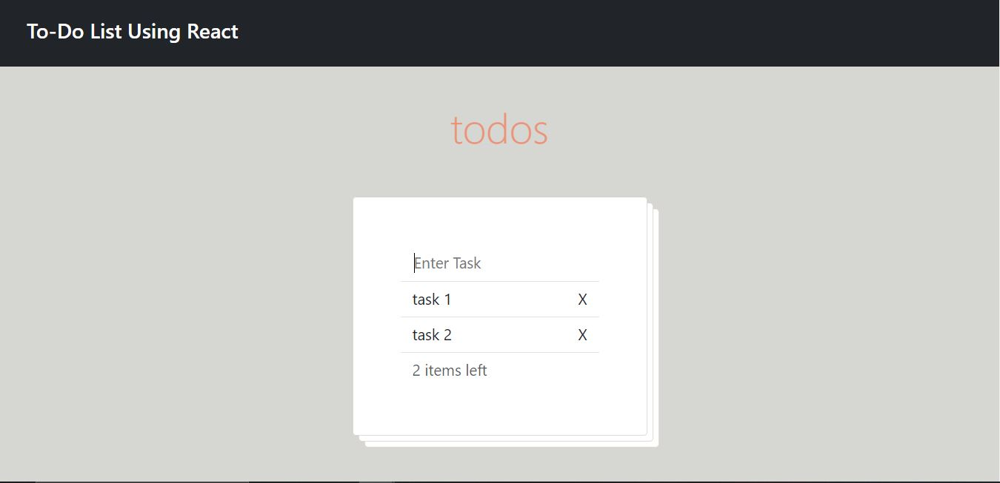

# React Audio Player

This is a simple audio player which retrieves songs from an api and lets the user play them.

The user can select a song, play random song, repeat song, set the volume and set the time of the song.

Preview:

